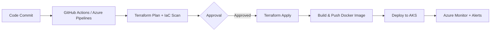

<div align="center">

# ⚙️ DevSecOps Engineer

### Cloud Infrastructure • Automation • CI/CD • Kubernetes • Security

[](https://azure.microsoft.com/)
[](https://aws.amazon.com/)
[](https://www.terraform.io/)
[](https://www.docker.com/)
[](https://kubernetes.io/)
[](https://github.com/features/actions)

</div>

---

## 👋 About Me

I build and automate **cloud infrastructure, deployment pipelines, and secure engineering workflows** with a strong focus on reliability, scalability, and automation.

My work spans **Azure and AWS**, Infrastructure as Code with **Terraform**, containerized workloads with **Docker and Kubernetes**, and CI/CD automation using **GitHub Actions and Azure DevOps**.

I also focus on bringing **DevSecOps practices into delivery pipelines** through security scanning, policy validation, secret detection, and infrastructure quality checks.

### 🚀 What I Work On

- ☁️ Cloud infrastructure and networking on **Azure & AWS**
- 🏗️ Infrastructure as Code using **Terraform**
- 🔄 CI/CD automation with **GitHub Actions & Azure DevOps**
- 🐳 Containerization using **Docker**
- ☸️ Kubernetes / AKS deployments and operations
- 🔐 DevSecOps, IaC security and secret detection
- 📈 Scalable, reliable and cost-conscious infrastructure
- 🤖 Automation and engineering productivity

---

## 🛠️ Tech Stack

### ☁️ Cloud & Infrastructure
`Microsoft Azure` `AWS` `Azure Networking` `VNet` `VPC` `NSG` `Load Balancer` `Application Gateway`

### 🏗️ Infrastructure as Code
`Terraform` `ARM Templates` `Terraform Modules` `Remote State`

### 🚀 Containers & Orchestration
`Docker` `Kubernetes` `AKS` `Container Registry`

### 🔄 CI/CD & Version Control
`GitHub Actions` `Azure DevOps` `Git` `GitHub` `GitLab` `Bitbucket` `Azure Repos`

### 🔐 DevSecOps
`TFLint` `tfsec` `Checkov` `Trivy` `Gitleaks` `TruffleHog` `SonarQube` `OWASP Dependency-Check`

### 🐧 Systems & Databases
`Linux` `Bash` `MySQL` `PostgreSQL` `ClickHouse`

### 📋 Collaboration & API Tools
`Jira` `Trello` `Asana` `Postman`

---

## 🏗️ Featured Engineering Areas

```text
Cloud
 ├── Azure
 └── AWS

Infrastructure
 └── Terraform
      ├── Modules
      ├── Networking
      ├── Security
      └── Remote State

Delivery
 ├── GitHub Actions
 └── Azure DevOps

Containers
 ├── Docker
 └── Kubernetes / AKS

Security
 ├── IaC Scanning
 ├── Secret Detection
 └── Code & Dependency Security
```

---

## 🔐 DevSecOps Approach

I believe security should be part of the delivery process rather than an afterthought.

```text
Developer
    │
    ▼
Git / Pull Request
    │
    ▼
CI Pipeline
    │
    ├── Code Quality
    ├── Terraform Validation
    ├── IaC Security
    ├── Secret Detection
    └── Dependency / Container Scanning
    │
    ▼
Build & Test
    │
    ▼
Deploy
    │
    ▼
Cloud / Kubernetes
```

---

## 📌 Current Focus

- ☁️ Advanced Azure & AWS architecture
- 🏗️ Terraform and reusable infrastructure modules
- ☸️ Kubernetes and container orchestration
- 🔐 DevSecOps and cloud security
- 🔄 Advanced CI/CD automation
- 💰 Cloud cost optimization and FinOps practices
- 🧩 Platform Engineering

---

## 📂 Projects

I use this profile to document practical work around:

- Azure / AWS infrastructure automation
- Terraform projects
- CI/CD pipelines
- Docker & Kubernetes deployments
- DevSecOps security automation
- Cloud networking and architecture
- Infrastructure monitoring and cost optimization

---

## 🚀 Technical Expertise

<div align="center">


</div>

<br>

  **Microsoft Azure**
- Microsoft Entra ID, MFA, PIM, and RBAC for identity and access governance
- Azure Landing Zone design, Management Groups, and Azure Policy / Initiatives
- Core networking — VNet, Subnet, NSG, Load Balancer, Application Gateway, Bastion Host, VPN Gateway
- Private Endpoints and Private DNS for zero-public-exposure architectures
- Compute and storage — VM, VMSS, Storage Accounts, Managed Identities, Availability Zones

  **Terraform (Infrastructure as Code)**
- Building reusable, modular Terraform configurations for repeatable deployments
- Managing Terraform Workspaces and Remote State Backends with state locking
- Writing lifecycle rules and variables to support multi-environment provisioning
- Automating Azure Landing Zone components through Infrastructure as Code

  **CI/CD & Automation**
- Designing YAML-based pipelines in Azure DevOps and GitHub Actions
- Automating infrastructure provisioning and application deployments across environments
- Managing release workflows with a focus on repeatability and rollback safety

  **Containers & Kubernetes**
- Containerizing applications with Docker for consistent deployments
- Operating workloads on Azure Kubernetes Service (AKS) — Deployments, Services, ConfigMaps, Secrets, Ingress
- Managing rolling updates for zero-downtime application delivery

  **DevSecOps, Security & Governance**
- Integrating Checkov, tfsec, and TFLint into pipelines for IaC security validation
- Using TruffleHog for secret detection and Infracost for cost visibility before deployment
- Managing Azure Key Vault, resource locks, resource tagging, and cost governance

  **Monitoring & Observability**
- Configuring Azure Monitor and Log Analytics Workspace for infrastructure visibility
- Setting up Azure Alerts, diagnostic settings, and Application Insights
- Tracking metrics and activity logs to support proactive issue resolution

  **Version Control & Scripting**
- Git and GitHub — branching strategy, pull requests, and merge workflows
- Azure Repos for source control within Azure DevOps
- PowerShell and Linux for day-to-day cloud administration and automation

<br>

<details>
<summary><strong>CI/CD Workflow I Typically Build</strong></summary>
<br>



</details>

## 📚 Currently Exploring

I'm intentionally expanding beyond Azure into areas that are shaping the next phase of cloud and platform engineering:

- ☁️ **AWS** — building cross-cloud fundamentals
- 🤖 **AIOps** — applying automation and ML to infrastructure operations
- 🧠 **MLOps** — understanding how ML workflows are deployed and managed
- 🔗 **Model Context Protocol (MCP)** and how AI tooling integrates with dev workflows
- 📚 **Retrieval Augmented Generation (RAG)** — conceptual understanding of applied LLM systems

## 🤝 Connect With Me

- 💼 **LinkedIn:** [linkedin.com/in/vikasdevops](https://www.linkedin.com/in/vikasdevops)
- 🐙 **GitHub:** [github.com/DevSecOps](https://github.com/Vikas-DevSecOps)
- 📧 **Email:** [vikas.cloudops@gmail.com](mailto:vikas.cloudops@gmail.com)
- 🌐 **Portfolio:** Coming Soon 🚧

<div align="center">

*⭐ "Automate Everything. Secure by Default. Build for Scale."⭐*

</div>


## 🤝 Let's Connect

I'm always interested in discussing **Cloud, DevOps, DevSecOps, Terraform, Kubernetes, automation, and infrastructure architecture**.

<div align="center">

### ⚡ Automate • Secure • Scale

</div>
